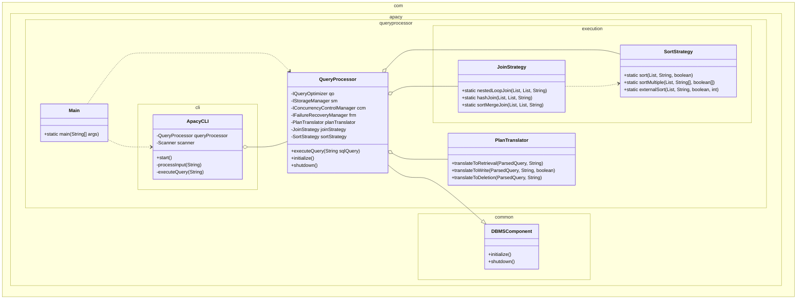

Kelompok Bash (Apacy - 5)

|NIM | Nama  |
|---|---|
|13523149|Naufarrel Zhafif Abhista|
|13523153|Muhammad Farrel Wibowo|
|13523160|I Made Wiweka Putera|
|13523152|Muhammad Kinan Arkansyaddad|
||M. Zulfiansyah Bayu Pratama|

