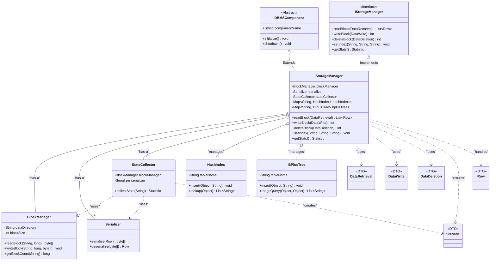

%% Class Diagram for StorageManager Internals

```mermaid
classDiagram
    direction TB
    
    %% Kelas Abstrak dan Interface
    class DBMSComponent {
        <<Abstract>>
        +String componentName
        +initialize() void
        +shutdown() void
    }
    
    class IStorageManager {
        <<Interface>>
        +readBlock(DataRetrieval) List~Row~
        +writeBlock(DataWrite) int
        +deleteBlock(DataDeletion) int
        +setIndex(String, String, String) void
        +getStats() Statistic
    }

    %% DTOs (Data Transfer Objects) - Eksternal
    class DataRetrieval { <<DTO>> }
    class DataWrite { <<DTO>> }
    class DataDeletion { <<DTO>> }
    class Statistic { <<DTO>> }
    class Row { <<DTO>> }

    %% Kelas Helper Internal
    class BlockManager {
        -String dataDirectory
        -int blockSize
        +readBlock(String, long) byte[]
        +writeBlock(String, long, byte[]) void
        +getBlockCount(String) long
    }
    class Serializer {
        +serialize(Row) byte[]
        +deserialize(byte[]) Row
    }
    class StatsCollector {
        -BlockManager blockManager
        -Serializer serializer
        +collectStats(String) Statistic
    }
    class HashIndex {
        -String tableName
        +insert(Object, String) void
        +lookup(Object) List~String~
    }
    class BPlusTree {
        -String tableName
        +insert(Object, String) void
        +rangeQuery(Object, Object) List~String~
    }
    
    %% Kelas Utama
    class StorageManager {
        -BlockManager blockManager
        -Serializer serializer
        -StatsCollector statsCollector
        -Map~String, HashIndex~ hashIndexes
        -Map~String, BPlusTree~ bplusTrees
        
        +readBlock(DataRetrieval) List~Row~
        +writeBlock(DataWrite) int
        +deleteBlock(DataDeletion) int
        +setIndex(String, String, String) void
        +getStats() Statistic
    }

    %% Relasi
    DBMSComponent <|-- StorageManager : Extends
    IStorageManager <|.. StorageManager : Implements
    
    StorageManager o-- "1" BlockManager : "has-a"
    StorageManager o-- "1" Serializer : "has-a"
    StorageManager o-- "1" StatsCollector : "has-a"
    StorageManager o-- "*" HashIndex : "manages"
    StorageManager o-- "*" BPlusTree : "manages"

    %% Dependensi (uses)
    StorageManager ..> DataRetrieval : "uses"
    StorageManager ..> DataWrite : "uses"
    StorageManager ..> DataDeletion : "uses"
    StorageManager ..> Statistic : "returns"
    StorageManager ..> Row : "handles"
    
    StatsCollector ..> BlockManager : "uses"
    StatsCollector ..> Serializer : "uses"
    StatsCollector ..> Statistic : "creates"
```