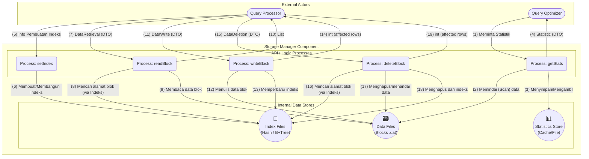

%% Data Flow Diagram for Storage Manager (Versi dengan Penomoran)

```mermaid
graph TD
    subgraph "External Actors"
        QP([Query Processor])
        QO([Query Optimizer])
    end

    subgraph "Storage Manager Component"
        direction LR
        
        subgraph "API / Logic Processes"
            P_Read("Process: readBlock")
            P_Write("Process: writeBlock")
            P_Del("Process: deleteBlock")
            P_Stats("Process: getStats")
            P_Idx("Process: setIndex")
        end

        subgraph "Internal Data Stores"
            DS_Data(("<font size=5>🗃️</font><br>Data Files<br>(Blocks .dat)"))
            DS_Index(("<font size=5>📇</font><br>Index Files<br>(Hash / B+Tree)"))
            DS_Stats(("<font size=5>📊</font><br>Statistics Store<br>(Cache/File)"))
        end
        
        %% Aliran Statistik (Biasanya langkah awal QO)
        QO -- "(1) Meminta Statistik" --> P_Stats
        P_Stats -- "(2) Memindai (Scan) data" --> DS_Data
        P_Stats -- "(3) Menyimpan/Mengambil" --> DS_Stats
        P_Stats -- "(4) Statistic (DTO)" --> QO
        
        %% Aliran Pembuatan Indeks (Bisa dipanggil QP kapan saja)
        QP -- "(5) Info Pembuatan Indeks" --> P_Idx
        P_Idx -- "(6) Membuat/Membangun Indeks" --> DS_Index
        
        %% Aliran Baca Data
        QP -- "(7) DataRetrieval (DTO)" --> P_Read
        P_Read -- "(8) Mencari alamat blok (via Indeks)" --> DS_Index
        P_Read -- "(9) Membaca data blok" --> DS_Data
        P_Read -- "(10) List<Row>" --> QP
        
        %% Aliran Tulis Data
        QP -- "(11) DataWrite (DTO)" --> P_Write
        P_Write -- "(12) Menulis data blok" --> DS_Data
        P_Write -- "(13) Memperbarui indeks" --> DS_Index
        P_Write -- "(14) int (affected rows)" --> QP
        
        %% Aliran Hapus Data
        QP -- "(15) DataDeletion (DTO)" --> P_Del
        P_Del -- "(16) Mencari alamat blok (via Indeks)" --> DS_Index
        P_Del -- "(17) Menghapus/menandai data" --> DS_Data
        P_Del -- "(18) Menghapus dari indeks" --> DS_Index
        P_Del -- "(19) int (affected rows)" --> QP
    end
```