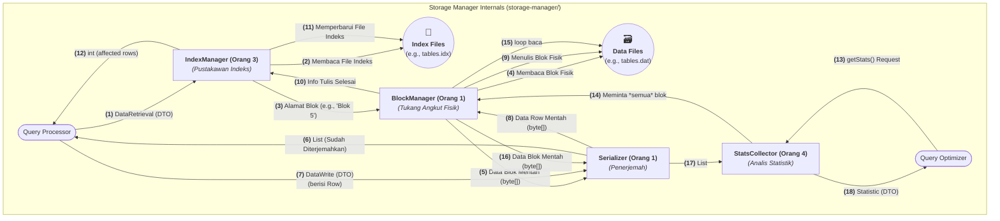

```mermaid
graph TD
    direction LR
    
    %% Aktor Eksternal
    QP([Query Processor])
    QO([Query Optimizer])

    subgraph "Storage Manager Internals (storage-manager/)"
        
        %% Proses (Helper Classes / Peran Anda)
        P_Serializer["<b>Serializer (Orang 1)</b><br><i>(Penerjemah)</i>"]
        P_BlockMgr["<b>BlockManager (Orang 1)</b><br><i>(Tukang Angkut Fisik)</i>"]
        P_Stats["<b>StatsCollector (Orang 4)</b><br><i>(Analis Statistik)</i>"]
        P_Idx["<b>IndexManager (Orang 3)</b><br><i>(Pustakawan Indeks)</i>"]

        %% Data Stores (File di Disk)
        DS_Data(("<font size=5>🗃️</font><br><b>Data Files</b><br>(e.g., tables.dat)"))
        DS_Index(("<font size=5>📇</font><br><b>Index Files</b><br>(e.g., tables.idx)"))
        
        
        %% --- Alur READ (Contoh) ---
        %% QP mengirim DTO, SM (koordinator) mengatur alurnya
        QP -- "<b>(1)</b> DataRetrieval (DTO)" --> P_Idx
        P_Idx -- "<b>(2)</b> Membaca File Indeks" --> DS_Index
        P_Idx -- "<b>(3)</b> Alamat Blok (e.g., 'Blok 5')" --> P_BlockMgr
        P_BlockMgr -- "<b>(4)</b> Membaca Blok Fisik" --> DS_Data
        P_BlockMgr -- "<b>(5)</b> Data Blok Mentah (byte[])" --> P_Serializer
        P_Serializer -- "<b>(6)</b> List<Row> (Sudah Diterjemahkan)" --> QP

        %% --- Alur WRITE (Contoh) ---
        QP -- "<b>(7)</b> DataWrite (DTO)<br>(berisi Row)" --> P_Serializer
        P_Serializer -- "<b>(8)</b> Data Row Mentah (byte[])" --> P_BlockMgr
        P_BlockMgr -- "<b>(9)</b> Menulis Blok Fisik" --> DS_Data
        P_BlockMgr -- "<b>(10)</b> Info Tulis Selesai" --> P_Idx
        P_Idx -- "<b>(11)</b> Memperbarui File Indeks" --> DS_Index
        P_Idx -- "<b>(12)</b> int (affected rows)" --> QP
        
        %% --- Alur STATS (Pekerjaan Orang 4) ---
        QO -- "<b>(13)</b> getStats() Request" --> P_Stats
        P_Stats -- "<b>(14)</b> Meminta *semua* blok" --> P_BlockMgr
        P_BlockMgr -- "<b>(15)</b> loop baca" --> DS_Data
        P_BlockMgr -- "<b>(16)</b> Data Blok Mentah (byte[])" --> P_Serializer
        P_Serializer -- "<b>(17)</b> List<Row>" --> P_Stats
        P_Stats -- "<b>(18)</b> Statistic (DTO)" --> QO

    end
```