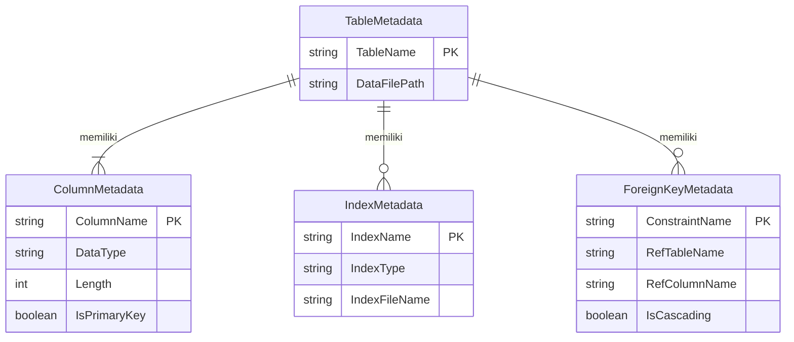

```mermaid
erDiagram
    TableMetadata ||--|{ ColumnMetadata : "memiliki"
    TableMetadata ||--o{ IndexMetadata : "memiliki"
    TableMetadata ||--o{ ForeignKeyMetadata : "memiliki"

    TableMetadata {
        string TableName PK
        string DataFilePath
    }

    ColumnMetadata {
        string ColumnName PK
        string DataType
        int Length
        boolean IsPrimaryKey
    }

    IndexMetadata {
        string IndexName PK
        string IndexType
        string IndexFileName
    }
    
    ForeignKeyMetadata {
        string ConstraintName PK
        string RefTableName
        string RefColumnName
        boolean IsCascading
    }
```