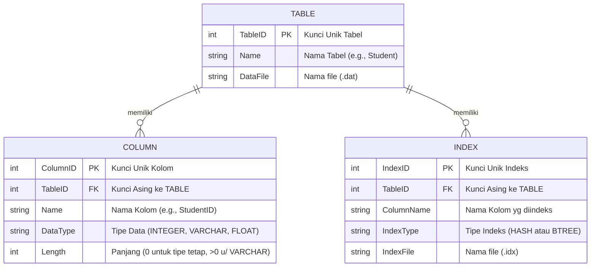

```mermaid
erDiagram
    TABLE {
        int TableID PK "Kunci Unik Tabel"
        string Name "Nama Tabel (e.g., Student)"
        string DataFile "Nama file (.dat)"
    }

    COLUMN {
        int ColumnID PK "Kunci Unik Kolom"
        int TableID FK "Kunci Asing ke TABLE"
        string Name "Nama Kolom (e.g., StudentID)"
        string DataType "Tipe Data (INTEGER, VARCHAR, FLOAT)"
        int Length "Panjang (0 untuk tipe tetap, >0 u/ VARCHAR)"
    }

    INDEX {
        int IndexID PK "Kunci Unik Indeks"
        int TableID FK "Kunci Asing ke TABLE"
        string ColumnName "Nama Kolom yg diindeks"
        string IndexType "Tipe Indeks (HASH atau BTREE)"
        string IndexFile "Nama file (.idx)"
    }

    TABLE ||--o{ COLUMN : "memiliki"
    TABLE ||--o{ INDEX : "memiliki"
```