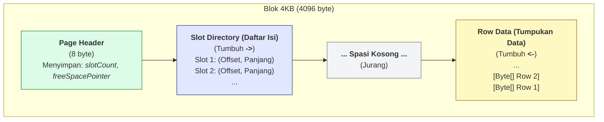

```mermaid
graph TD
    direction LR
    subgraph "Blok 4KB (4096 byte)"
        H["<b>Page Header</b><br>(8 byte)<br>Menyimpan: <i>slotCount</i>, <i>freeSpacePointer</i>"]
        S["<b>Slot Directory (Daftar Isi)</b><br>(Tumbuh <b>-></b>)<br>Slot 1: (Offset, Panjang)<br>Slot 2: (Offset, Panjang)<br>..."]
        F["<b>... Spasi Kosong ...</b><br>(Jurang)"]
        D["<b>Row Data (Tumpukan Data)</b><br>(Tumbuh <b><-</b>)<br>...<br>[Byte[] Row 2]<br>[Byte[] Row 1]"]
    end
    
    H --> S --> F --> D

    style H fill:#dcfce7,stroke:#15803d
    style S fill:#e0e7ff,stroke:#312e81
    style D fill:#fef9c3,stroke:#a16207
    style F fill:#f3f4f6,stroke:#6b7280
```